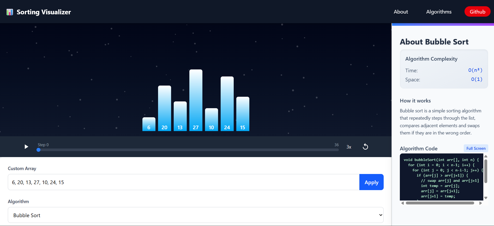

# Sorting Algorithm Visualizer

<h2 align="center">
  Interactive Sorting Algorithm Visualization<br/>
  <a href="https://sort-x-vert.vercel.app/" target="_blank">Live Demo</a>
</h2>

<div align="center">
  
</div>

<br/>

<center>

[](https://forthebadge.com) &nbsp;

[](https://forthebadge.com) &nbsp;
[](https://forthebadge.com) &nbsp;
[](https://forthebadge.com) &nbsp;

</center>
<div align="center">
  🔹 <a href="https://github.com/Guru54/sort-x/issues">Report Bug</a> • 
  <a href="https://github.com/Guru54/sort-x/issues">Request Feature</a> 🔹
</div>


## TL;DR

This interactive visualization tool helps you understand how sorting algorithms work by animating each step of the sorting process. You can customize array size, sorting speed, and algorithm selection.
You can fork this repo to modify and make changes of your own. Please give me proper credit by linking back to Guru54. Thanks!

## Built With

This project was built using modern web technologies:

- **React.js** - Frontend library
- **React Hooks** - State management
- **Tailwind** - Styling

- **CSS Modules** - Component styling
- **Algorithms** - Bubble Sort, Insertion Sort, Selection Sort, Quick Sort, Merge Sort
- **Vite** - Build tooling
- **Vercel** - Deployment

## Features

**📊 Real-time Visualization**  
Watch algorithms sort data with beautiful bar animations

**⚙️ Customizable Parameters**  
Adjust array size, sorting speed, and algorithm selection

**📈 Performance Metrics**  
Compare swaps, comparisons, and execution time

**📱 Fully Responsive**  
Works on desktop, tablet, and mobile devices

**🔁 Step-by-Step Control**  
Play, pause, or step through the sorting process

## Getting Started

Follow these instructions to set up the project locally.

### 🛠 Installation and Setup

1. Clone the repository:
```bash
git clone https://github.com/Guru54/sort-x.git
```

2. Install dependencies:
```bash
cd sorting-visualizer
npm install
```

3. Start the development server:
```bash
npm run dev
```

4. Open your browser at [http://localhost:5173](http://localhost:3000)

## Usage Instructions

1. **Customize your array**:
   - Create custom arrays with specific values

2. **Select an algorithm**:
   - Choose from Bubble Sort, Insertion Sort, Selection Sort, Quick Sort, or Merge Sort
   - View algorithm description and complexity analysis

3. **Control visualization**:
   - Click ▶️ Play to start automatic sorting
   - Use ⏸️ Pause and ⏩ Step buttons for manual control
   - Adjust speed with the speed slider

4. **Analyze performance**:
   - Track comparisons and swaps in real-time
   - View execution time after sorting completes
   - Compare algorithm efficiency

### Show your support

Give a ⭐ if you find this project useful!

<a href="buymeacoffee.com/guru54" target="_blank">
  
</a>

